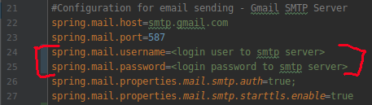
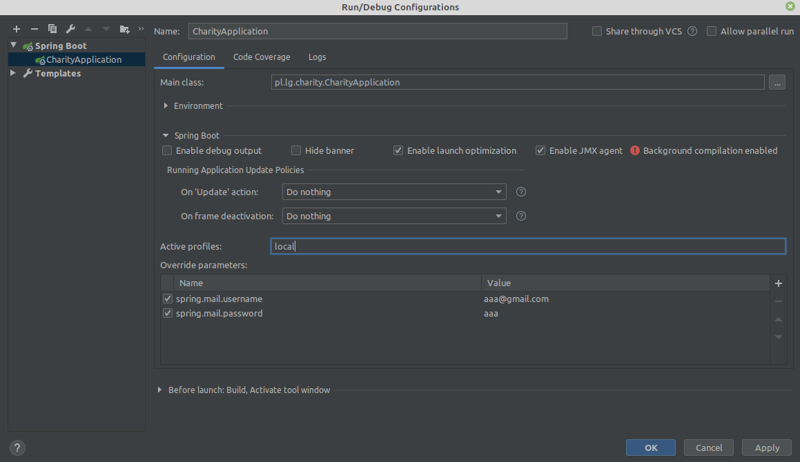

# give-in-good-hand
The purpose of this project is created a new place where everybody can give all your inessentials 
things (which you already don't use) back to charitable trust.

This Web App has been deployed to Heroku cloud and is available for viewing and testing under the following url:

https://giveingoodhand.herokuapp.com/

Please check the app features. There are two default users: user and admin. You can sign up your own account like 
user or check default user and check default admin.

## For User Account:
- email: user@gmail.com
- password: user

## For Admin Account:
- email: admin@gmail.com
- password: admin

## Technologies

**Backend:** Java, Spring (Boot, Security, Form, Data JPA), Hibernate

**Frontend:** HTML, CSS, Bootstrap

## Sending activation link in email after User Registration

The registration confirmation mechanism forces the user to respond to a “Confirm Registration” email sent after 
successful registration to verify his email address and activate their account. The user does this by clicking 
a unique activation link sent to them over email. This link will expire within 24 hours following its creation.

**Gmail SMTP Properties**
We can send an email via Gmail SMTP server. We have to specify the mail server properties in the application.properties 
file using the spring.mail.* namespace - like on the picture below:

The password for your account should not be an ordinary password, but an application password generated for 
your google account. Follow this <a href="https://support.google.com/accounts/answer/185833">link</a> to see 
the details and to generate your Google App Password. You can add the username and the password for your account as 
override parameters and remove it from application.properties. 

Choose from menu Run –> Edit Configurations... and add parameters clicking "+" button on the right side:

## Current Status

Finished.
